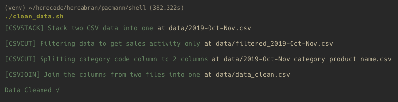

### Tujuan Pengerjaan
>Untuk memenuhi Tugas 4 SQL & SHELL Tooling Pacmann non-degree program BI Batch 9

## Deskripsi Tasks
#### 1. Check installed python and csvkit
```bash
command -v python 1>/dev/null || command -v python3 1>/dev/null || (echo "Install Python to run the program" && exit 1)
command -v csvlook 1>/dev/null || (echo "Run `pip install csvkit` to run the program" && exit 1)
```
#### 2. Stack two CSV data into one
```bash
csvstack data/2019-Oct-sample.csv data/2019-Nov-sample.csv > data/2019-Oct-Nov.csv
```
#### 3. Filtering data to get sales activity only
```bash
csvcut -c event_time,event_type,product_id,category_id,brand,price,category_code data/2019-Oct-Nov.csv > data/filtered_2019-Oct-Nov.csv
```
#### 4. Splitting category_code column to 2 columns
```bash
echo "category,product_name" > data/2019-Oct-Nov_category_product_name.csv
csvcut -c category_code data/filtered_2019-Oct-Nov.csv | tail -n +2 | awk -F "." 'OFS="," {print $1, $NF}' >> data/2019-Oct-Nov_category_product_name.csv
```
#### 5. Join the columns from two files into one
```bash
csvjoin data/filtered_2019-Oct-Nov.csv data/2019-Oct-Nov_category_product_name.csv | csvcut -c event_time,event_type,product_id,category_id,brand,price,category,product_name > data/data_clean.csv
```

## How to run the scripts
#### `Prerequisites: Place the sample Data`
**NOTE:**
Read the docs [here](data/README.md).
#### 1. Run the script to Clean the Sample Data
```bash
./clean_data.sh
```
**OR**
```bash
bash clean_data.sh
```
*Result:*

#### 2. Run the script to Check cleaned data with minimal stats
```bash
./data_stats.sh
```
**OR**
```bash
bash data_stats.sh
```
*Result:*

#### 3. Run the script to cleanup file in the working directory
```bash
./cleanup_project.sh
```
**OR**
```bash
bash cleanup_project.sh
```

### Saran Perbaikan
>Splitting data dengan csv join kurang optimal